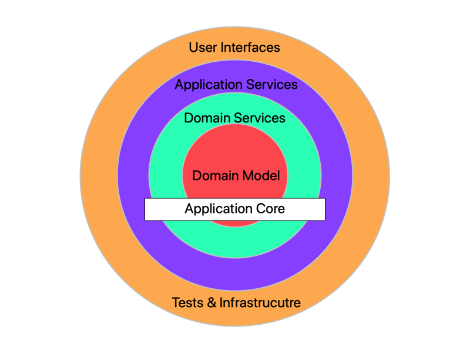

# Shopping Basket

An application that implements a Command Query Responsibility Segregation (CQRS) and Event Sourcing framework to implement and manage a shopping basket system using [EventFlow](https://github.com/EventFlow) framework.

**Features**

- Event Store and Read Model/Database using EntityFramework Core (InMemory Provider)
- [Swashbuckle](https://github.com/domaindrivendev/Swashbuckle.AspNetCore) to generate API documentation + UI to explore and test endpoints
- [AutoRest](https://github.com/Azure/autorest) to generate a client library
- Validation done with [FluentValidation](https://github.com/JeremySkinner/FluentValidation)

## Install

Core Requirements

- .NET Core 2.1

### Usage

```sh
# build
dotnet build -c Release -o src/ShoppingBasket.WebApi

# start the app
dotnet src/ShoppingBasket.WebApi/bin/Release/netcoreapp2.1/ShoppingBasket.WebApi.dll

# access
https://localhost:5001/swagger # -- this will open Swagger UI
```

## Architecture

System is based on the Onion Architecture



---

CQRS/ES using [EventFlow](https://github.com/EventFlow)

## Assumptions

- Product management is done externally
- Customer account already exists in the system

## API Endpoints

### CREATE BASKET

```curl
POST /api/v1/basket
```

```json
{
  "customerId": "eb042700-242e-49ee-9a5b-842a9cabb455"
}
```

### GET BASKET

```curl
GET /api/v1/basket/{basketId}
```

### ADD ITEM TO BASKET

```curl
POST /api/v1/basket/{basketId}
```

```json
{
  "productName": "Product 1",
  "price": 10.99,
  "quantity": 2
}
```

### UPDATE BASKET ITEM QUANTITY

```curl
PUT /api/v1/basket/{basketId}
```

```json
{
  "productName": "Product 1",
  "quantity": 4
}
```

### REMOVE ITEM FROM BASKET

```curl
DELETE /api/v1/basket/{basketId}
```

```json
{
  "productName": "Product 1"
}
```

### CLEAR BASKET

```curl
DELETE /api/v1/basket/{basketId}/clear
```

## Notes

- API doc is also available via Swagger and testing can be done by Swagger UI (https://localhost:5001/swagger)
